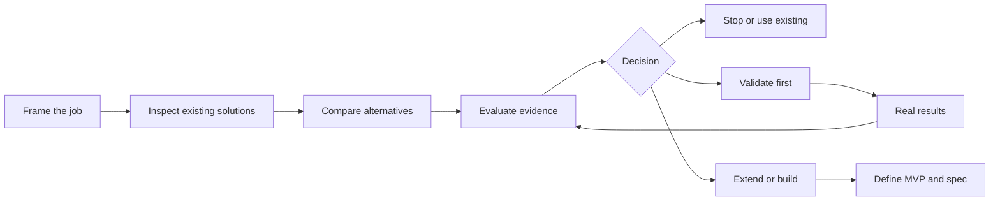

<div align="center">


# Skill Product Manager

**Turn an AI product idea into an evidence-backed decision.**

Research what exists. Decide whether to reuse, validate or build. Define only the product worth pursuing.

[](https://github.com/JaneHuang1833/skill-product-manager/actions/workflows/ci.yml)
[](LICENSE)
[](CHANGELOG.md)
[](#the-seven-skills)

[Quick start](#quick-start) · [Installation](docs/installation.md) · [Examples](examples/README.md) · [Contributing](CONTRIBUTING.md)

</div>

## Why this exists

An interesting idea is not yet a product worth building. For Skills, Plugins, MCP tools and Agents, a saved prompt or existing integration may already solve the job. The hard part is establishing what is missing, what evidence supports it and which uncertainty to test first.

This plugin gives your assistant a reusable product discovery method. It produces a traceable decision, a practical validation plan, or a bounded specification with acceptance criteria.

A useful result can be **STOP** or **USE EXISTING**. More documents and more features are not the success metric.

## Quick start

Add the repository marketplace with a supported Codex CLI:

```sh
codex plugin marketplace add JaneHuang1833/skill-product-manager --ref v0.2.0
```

Open the Plugins Directory in your supported desktop client, select **Skill Product Manager**, and install the plugin from that marketplace. Start a new chat. Client availability varies; see the [installation guide](docs/installation.md) for local setup and verification.

Then ask:

```text
Use $discover-skill-product to investigate this idea:
A plugin that turns a supplied meeting transcript into owner-confirmed action items.
Start with individual project leads, research existing solutions, and recommend
whether to reuse, validate or build. Keep unverified claims explicit.
```

The assistant first frames the job, asks only decisive missing questions, then researches actual sources. It follows the resulting decision instead of automatically generating a PRD.

For one stage, invoke its skill directly:

```text
Use $ecosystem-scan to research existing solutions for this bounded idea.
Use $similarity-analysis to compare these inspected candidates.
Use $validation-plan to test the most consequential assumption in this review.
```

## What you get

| Output | What it makes explicit |
|---|---|
| Idea Brief | User, trigger, job, alternative, result, constraints and proposed form |
| Ecosystem Scan | Inspected candidates, actual search coverage and access limits |
| Similarity Analysis | Six additive dimensions, source-backed comparisons and gaps |
| Opportunity Review | Evidence, counterevidence, assumptions and one recommendation |
| Validation Plan | Behavior metrics, denominators, thresholds, inconclusive and stop rules |
| Product Definition / Spec | Bounded MVP, P0 requirements, permissions and acceptance |
| Discovery Dossier | Current stage, versioned artifacts, unknowns and next action |

Detailed records live in saved artifacts when file tools are available. Chat stays focused on the decision. With no file access, the requested deliverables are provided inline.

## The seven skills

| Skill | Use when you need to… |
|---|---|
| [discover-skill-product](skills/discover-skill-product/SKILL.md) | Run or resume the whole idea-to-decision workflow |
| [idea-framing](skills/idea-framing/SKILL.md) | Clarify the user, situation, job and product form |
| [ecosystem-scan](skills/ecosystem-scan/SKILL.md) | Find and inspect existing solutions |
| [similarity-analysis](skills/similarity-analysis/SKILL.md) | Compare verified candidates and reusable ideas |
| [product-opportunity-evaluation](skills/product-opportunity-evaluation/SKILL.md) | Choose whether to stop, reuse, extend, validate or build |
| [validation-plan](skills/validation-plan/SKILL.md) | Design the cheapest test of a consequential unknown |
| [product-definition](skills/product-definition/SKILL.md) | Define an MVP, 18-section spec and technical handoff |



## Research you can audit

- Claims distinguish **Fact**, **Inference**, **Assumption** and **Recommendation**.
- Verification status is separate from confidence. Reading a marketing claim is not proof that the claim is true.
- Search logs record executed queries and inspected sources. Inaccessible surfaces stay visible.
- Unknown similarity dimensions use `null` and intervals. They are never treated as zero or normalized away.
- Fork recommendations require actual license evidence.
- User overrides are recorded without rewriting the evidence to agree with them.
- Changed jobs or users invalidate affected downstream artifacts.

See the [evidence guide](docs/evidence.md) and [artifact contracts](references/io-contracts.md).

## Requirements and boundaries

This is an **instruction-based, skills-only plugin**. It has no bundled MCP server, account, background agent, telemetry, hook or credential setup.

| Capability | Requirement |
|---|---|
| Skill-capable host | Needed to load and apply the instructions |
| Live search + source reading | Needed for current ecosystem findings |
| Local file tools | Optional; enables saved dossiers and documents |
| GitHub / browser / marketplace connectors | Optional; use whatever the host provides |
| Python 3.10+ | Only for the arithmetic helper and development tools |
| PyYAML + jsonschema | Development validation only |

If live research is unavailable, the assistant can frame an idea and analyze supplied material, but must label the research offline or limited. Product discovery does not authorize contacting people, launching experiments or deploying software; existing user authorization remains authoritative.

The package is structurally validated and includes behavior evaluation cases. This is not a claim of exhaustive competitor recall, automatic factual accuracy or compatibility with every host. See [compatibility and troubleshooting](docs/installation.md#compatibility-and-troubleshooting).

## Try a complete example

The [synthetic meeting follow-up example](examples/meeting-followup/README.md) includes a brief, mock candidate evidence, comparison inputs, a conditional decision and a validation plan. It demonstrates the artifact shape without presenting fictional products as live research.

```sh
python scripts/score_similarity.py examples/similarity/provisional.json
```

This returns an observed subtotal of **9.5**, a range of **[9.5, 10]**, and no confirmed total because distribution evidence is missing.

## Development

```sh
git clone https://github.com/JaneHuang1833/skill-product-manager.git
cd skill-product-manager
python3 -m venv .venv
. .venv/bin/activate
python -m pip install -r requirements-dev.txt
python scripts/check.py
python scripts/build_release.py
```

For Windows activation and additional checks, see [development](docs/development.md). The build creates a deterministic ZIP and SHA-256 file in `dist/`.

## Documentation

- [Installation and updates](docs/installation.md)
- [Usage and decision routes](docs/usage.md)
- [Evidence, scores and artifacts](docs/evidence.md)
- [Testing status and limits](docs/testing.md)
- [Architecture](ARCHITECTURE.md)
- [Examples](examples/README.md)
- [Development and release process](docs/development.md)
- [Roadmap](ROADMAP.md) · [Changelog](CHANGELOG.md)
- [Contributing](CONTRIBUTING.md) · [Support](SUPPORT.md)
- [Security](SECURITY.md) · [Privacy](PRIVACY.md)
- [Design provenance](references/design-sources.md)

## Contributing

Useful contributions include reproducible routing failures, inspected research benchmarks, clearer contracts, better edge-case handling and host compatibility evidence. Start with [CONTRIBUTING.md](CONTRIBUTING.md). Report issues without private product data or credentials.

## License and attribution

[MIT](LICENSE), copyright 2026 JaneHuang1833. Conceptual inspiration from [phuryn/pm-skills](https://github.com/phuryn/pm-skills) is documented in [design sources](references/design-sources.md). This project is independently maintained and is not an official OpenAI product.
